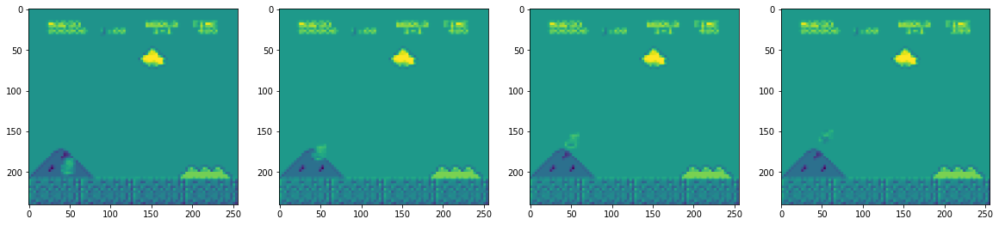
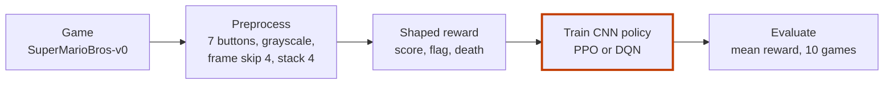
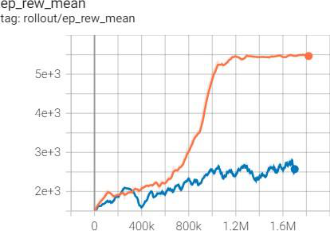

# Mario AI: Reinforcement Learning in Super Mario

[](https://www.python.org/)
[](https://stable-baselines3.readthedocs.io/)
[](https://github.com/Kautenja/gym-super-mario-bros)
[](LICENSE)

**An agent learns to play Super Mario Bros from the raw screen, and PPO is compared with DQN on the same level.**



*What the agent sees: the last four grayscale frames of World 1-1. Notebook output, in matplotlib's default colours.*

Think of a child who gets a game console with no manual.
They press buttons, watch the screen, and repeat what earned points.
Reinforcement learning works the same way: the agent only sees pixels and a score.
Here, PPO finished Level 1 and passed some areas of Level 2. DQN could not finish Level 1.

- **What it does:** trains a CNN policy on `SuperMarioBros-v0` with PPO and with DQN, then compares the two.
- **Why you can trust the comparison:** both agents share the same preprocessing and reward, and both are scored on 10 games with `evaluate_policy`.
- **What is included:** the notebook, both trained models (Git LFS), the TensorBoard logs and the paper.

Bachelor's project, Faculty of Technology, Firat University, 2022–2023, by Tarık Bulut.
Sibling project, same paper: [Doom AI](https://github.com/Estaed/Doom-AI).

## Quick start

```bash
git lfs install   # the two trained models are stored with Git LFS
git clone https://github.com/Estaed/Mario-AI.git
cd Mario-AI
pip install gym_super_mario_bros==7.3.0 nes_py
pip install torch torchvision torchaudio --index-url https://download.pytorch.org/whl/cu117
pip install stable-baselines3[extra]
jupyter notebook Mario_AI.ipynb
```

The three `pip` lines are the notebook's own install cells. The `cu117` line installs PyTorch for an NVIDIA GPU (the runs used a GTX 1060).
The code uses the older gym API: `step()` returns four values.

In the notebook, run sections 0–2 to build the environment.
In section 3, run either the PPO cell or the DQN cell, then `model.learn(total_timesteps=2000000, ...)`.
To watch a saved agent instead of training, run section 4 with the model file from the repo root, for example `model = DQN.load('model_DQN_1700000', env=env)`.

## How it works



1. **Game.** `gym-super-mario-bros` runs the NES game in Python, starting at World 1-1.
2. **Buttons.** `JoypadSpace` with `SIMPLE_MOVEMENT` cuts the choices to 7: NOOP, right, right+A, right+B, right+A+B, A, left.
3. **Screen.** Stable-Baselines3's `AtariWrapper` turns the frame gray and skips frames (a decision every 4th frame). The frame is resized to 240 × 256.
4. **Memory.** `VecFrameStack` stacks the last 4 frames, so the agent can see motion. The input is `(1, 240, 256, 4)`.
5. **Reward.** The game's own reward is kept. A `CustomReward` wrapper adds in-game score / 40, +350 for reaching the flag and −50 for an episode that ends without it. The total is divided by 10.
6. **Train.** A `CnnPolicy` learns with PPO or DQN, up to 2 million steps. A callback saves a checkpoint every 100,000 steps.
7. **Evaluate.** `evaluate_policy` plays 10 games and returns the mean reward.

## Results



*Mean episode reward over about 1.8M steps. PPO is orange, DQN is blue. TensorBoard chart from the paper (Figure 8).*

| | PPO | DQN |
|---|---|---|
| Mean reward, 10 games | 5542.2 | 2430.8 |
| Level reached | finished Level 1, passed some areas of Level 2 | did not finish Level 1 |
| Saved model | `model_PPO_1800000.zip` (1.8M steps, 289 MB) | `model_DQN_1700000.zip` (1.7M steps, 385 MB) |
| Training time | about 50,000 s | about 60,000 s |

**PPO was more successful than DQN.** It also had steadier episode lengths and a higher FPS.
DQN kept a lower, steadier loss.
The DQN score comes from the notebook output; the PPO score and the training times come from the paper.
For the full findings, read the paper: [`Playing Mario and Doom with RL_EN.pdf`](Playing%20Mario%20and%20Doom%20with%20RL_EN.pdf).

<details>
<summary><b>Hyperparameters</b></summary>

Both models use `CnnPolicy`, a learning rate of 1e-5 and a discount γ of 0.95.

| Setting | PPO | DQN |
|---|---|---|
| Rollout `n_steps` | 8192 | – |
| Clip range | 0.1 | – |
| GAE `gae_lambda` | 0.9 | – |
| Batch size | – | 64 |
| Replay buffer | – | 10,000 |
| `learning_starts` | – | 5,000 |
| Target steps | 2,000,000 | 2,000,000 (stopped at about 1.7M) |

Environment: `make_vec_env('SuperMarioBros-v0', seed=42, wrapper_class=mario_wrapper)`, then `VecFrameStack(env, 4, channels_order="last")`.

</details>

<details>
<summary><b>What the paper discusses</b></summary>

- **Performance evaluation:** PPO and DQN were trained on the same setup, and their effectiveness was compared.
- **Challenges:** training stability, exploration strategies and optimisation techniques.
- **Doom:** the paper also covers the Doom experiments. It is the same paper as in the [Doom AI](https://github.com/Estaed/Doom-AI) repository.

</details>

<details>
<summary><b>Files in this repository</b></summary>

| Path | What it is |
|---|---|
| `Mario_AI.ipynb` | Full implementation: install, setup, preprocessing, training, testing, GIF export |
| `model_PPO_1800000.zip` | Trained PPO model (Git LFS) |
| `model_DQN_1700000.zip` | Trained DQN model (Git LFS) |
| `logs/` | TensorBoard logs of the training runs: `PPO_1` to `PPO_4`, `DQN_1` |
| `Playing Mario and Doom with RL_EN.pdf` | The paper: method, results and conclusions for Mario and Doom |
| `docs/img/` | Images in this README, taken from the notebook and the paper |

To browse the logs: `tensorboard --logdir logs`.

</details>

## Author

Tarık Bulut. Questions or suggestions are welcome as an issue.

## Licence

[MIT](LICENSE).
